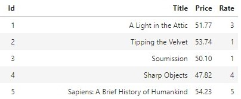
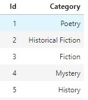

# Scraping-data-with-some-operations-using-sqlite
Scraping website contains of books with some details and save the data into database then making some operations in it and in the end save the data into csv file
<h3>Sample of books table</h3>

<h3>Sample of categories table</h3> 

<a href="https://books.toscrape.com">The link of the website</a>
